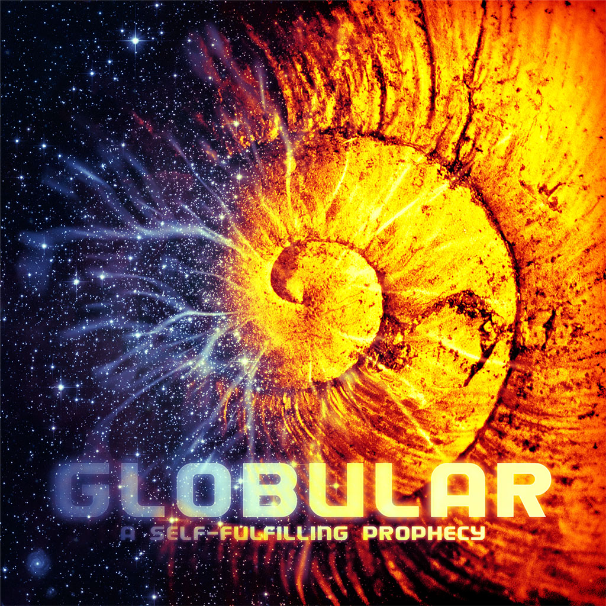
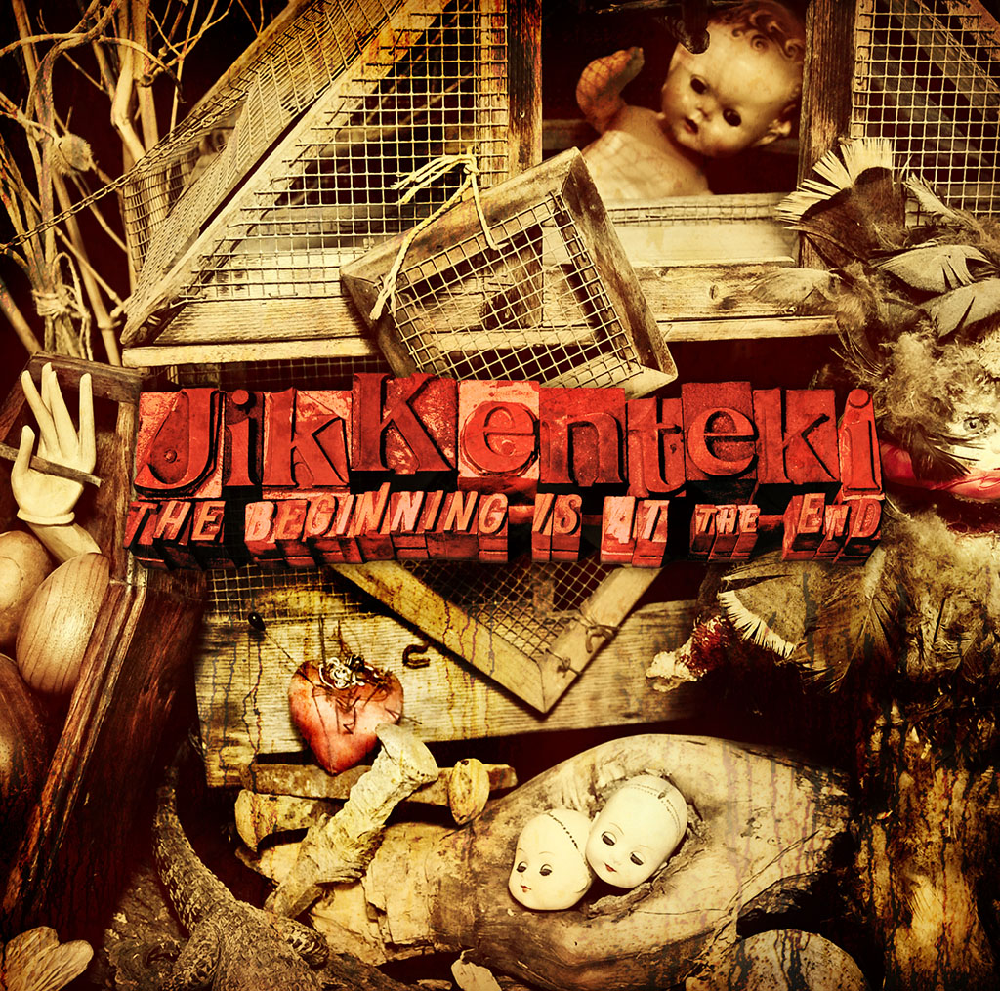
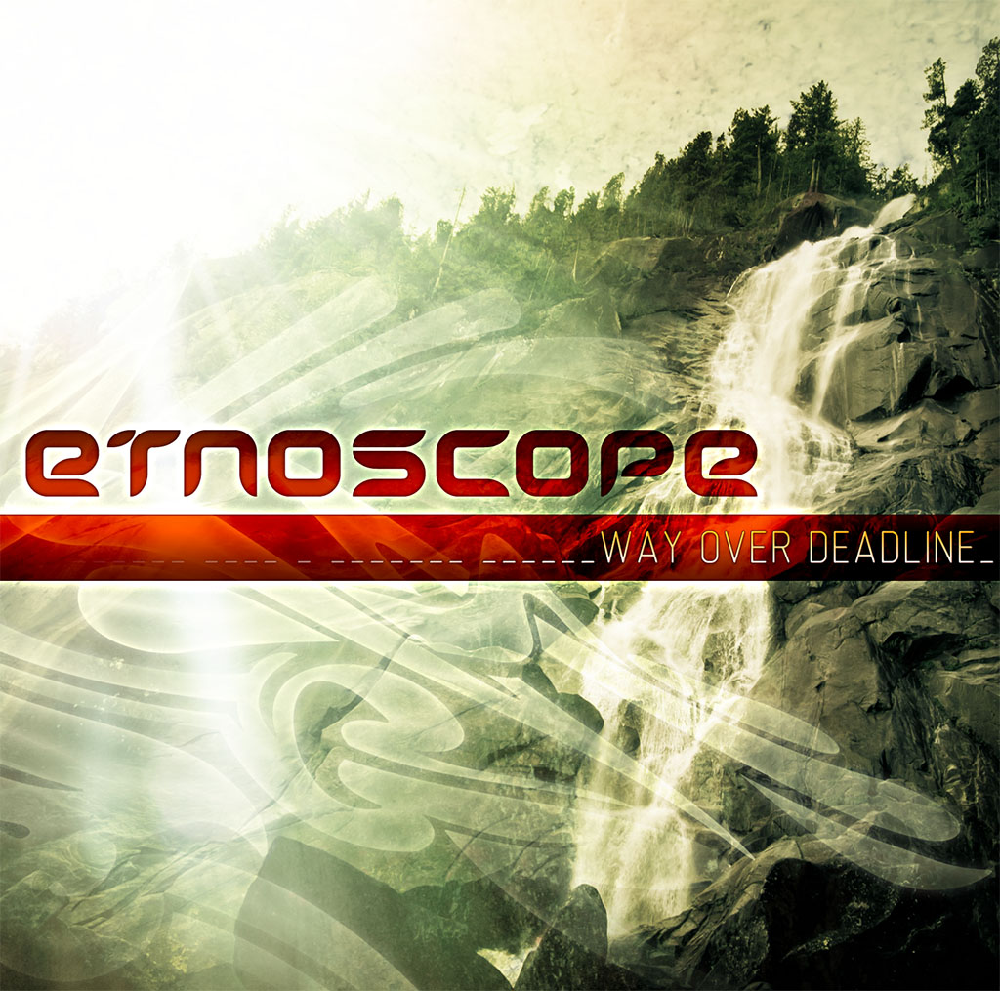
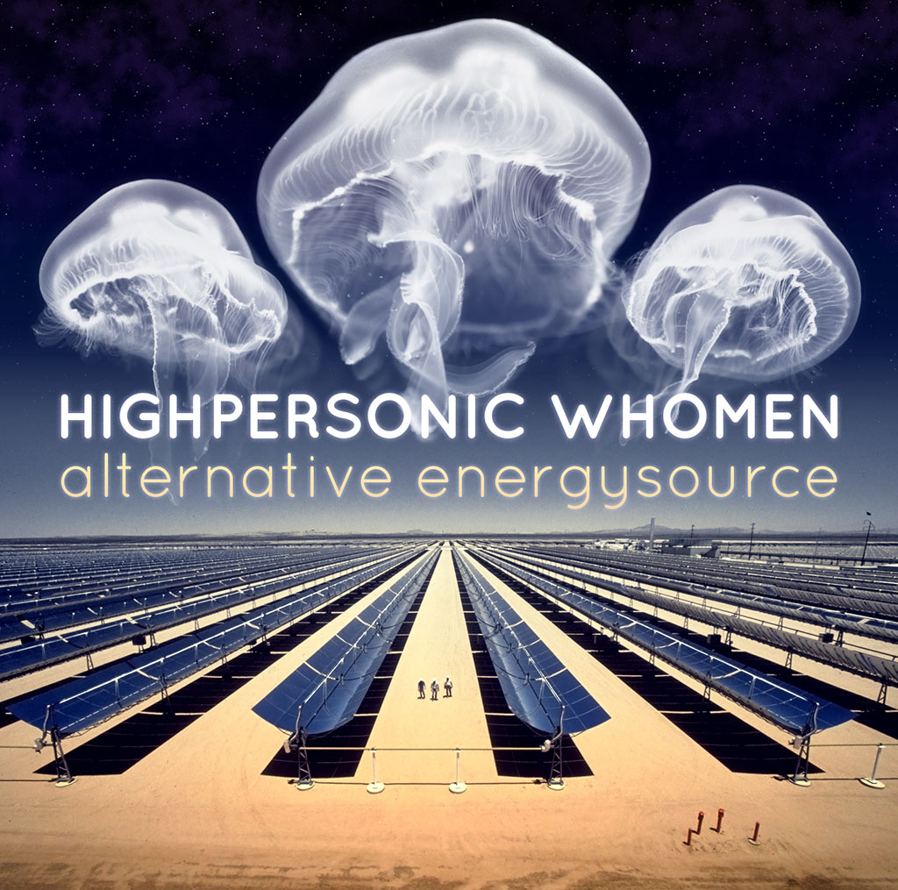
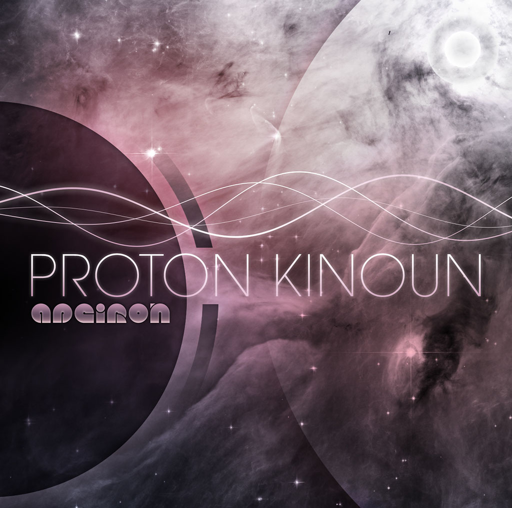
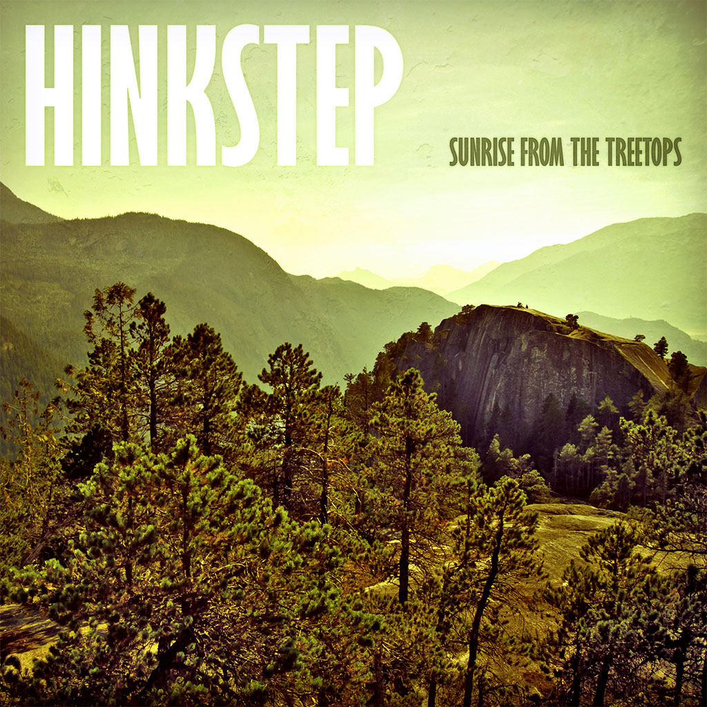

I am a self-taught designer with more than 15 years of experience in the graphic arts. I use Adobe Photoshop, Illustrator, and Lightroom to make my dreams come alive. My source material is varied, with generated graphics, Creative Commons and public domain imagery, and [my own photography](/photography) entering into my work.

From 1999 to 2007 I worked in the information technology industry as a front-end developer and user interface designer. It was purely corporate work, bland and uninteresting to my artistic soul, and I haven't kept any of it. Eventually I quit and went to university--but I did not give up on design. I set myself free and refused all paying work, preferring to devote myself to my own creative projects.

In this time I completed more than 50 album covers, most of which were produced for my record label, [Ektoplazm](http://www.ektoplazm.com/profiles/ektoplazm). The vast majority of these projects feature a "maximal" approach to design, often integrating [my own original photography](/photography/). Here are a few examples:

To see more of my design work please visit my [portfolio](http://synapticism.com/c/portfolio/design/).
