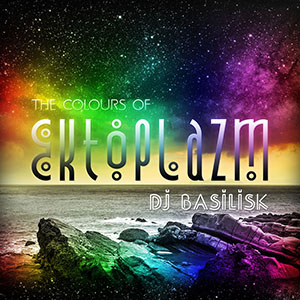
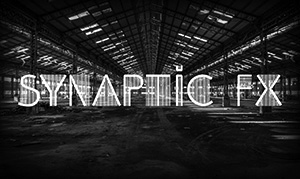
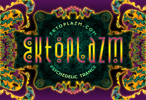

 I have been passionate about music for as long as I can remember. Over the years this has driven me to apply myself to various music-related projects. I never seem to get around to creating music myself--but I certainly facilitate its production and consumption through DJing, operating several record labels, and managing my [free music distribution portal](http://www.ektoplazm.com).

## DJing

### Basilisk

 [Basilisk](http://www.ektoplazm.com/profiles/basilisk) is my stage name in the psychedelic trance scene since 2000. I pride myself on being a generalist, playing a wide range of different styles within the psytrance genre. My goal has always been to celebrate the diversity of psytrance rather than focus on one small piece of the puzzle. I also have a healthy respect for the quality of timelessness in music and tend to take on the role of musical archaeologist by exploring the obscure depths of trance music history in my mixes and sets.

Find [Basilisk](http://www.ektoplazm.com/profiles/basilisk) on [Mixcloud](http://mixcloud.com/Basilisk) and [Facebook](https://www.facebook.com/DJ.Basilisk).

### Synaptic FX

 [Synaptic FX](http://mixcloud.com/SynapticFX) is the name I use for house and techno DJing. It is under this alias that I focus on more cutting edge trends in electronic music culture from deep house to pop techno. My goal with this project is to express my love for futurism in music. In this way both my projects are evenly balanced.

Find [Synaptic FX](http://drumlore.com/profile/synaptic-fx/) on [Mixcloud](http://mixcloud.com/SynapticFX) and [Facebook](https://www.facebook.com/SynapticFX).

## Record labels

### Ektoplazm

 [Ektoplazm](http://www.ektoplazm.com) is the name of my music distribution portal as well as my first netlabel. Founded in 2008, the Ektoplazm netlabel is dedicated to promoting unconventional talent with a professional approach to releasing free music in MP3, FLAC, and WAV format. The label has no defining sound; instead, it is dedicated to showcasing the range and diversity of the global psychedelic trance movement, always with an ear for quality. Altogether the label's releases have been downloaded more than 800,000 times as of 2013.

Find [Ektoplazm](http://www.ektoplazm.com/profiles/ektoplazm) on [SoundCloud](https://soundcloud.com/ektoplazm), [Twitter](https://twitter.com/Ektoplazm) and [Facebook](https://www.facebook.com/Ektoplazm).

### Omnitropic

Omnitropic is Ektoplazm's downtempo and ambient sublabel. Founded in 2009, this label is dedicated to releasing a wide range of high-quality downtempo, ambient, psychedelic dub, and experimental electronic music compatible with psychedelic trance culture.

[Omnitropic discography](http://www.ektoplazm.com/profiles/omnitropic).

### Drumlore

Drumlore was originally founded in 2009 as an experiment in using free music to promote real-world progressive techno events. Every release in the original Drumlore series was designed to promote a party featuring the artist on that same release. These releases were put out about a month in advance of each event, all of which were held in Toronto and generally well-attended. I also took a different approach with the album artwork in the original series; each piece was produced during a "one hour design challenge".

After my original co-founder left the project I operated Drumlore similarly to my other labels, focusing on a contemporary fusion of minimal, progressive, and psychedelic dance music under 130 BPM.

[Drumlore discography](http://www.ektoplazm.com/profiles/drumlore).
