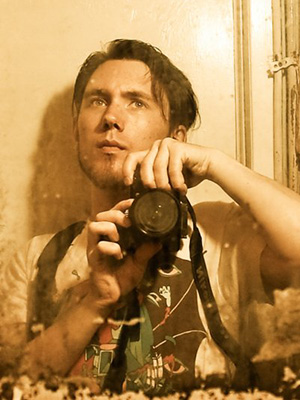

 My insatiable curiosity and perpetual wanderlust compel me to explore this strange and fantastical world of ours in a deep and incisive way. With [my photography](http://synapticimagery.com) I aim to share my adventures filtered through the lens of memory, as surreal and dreamlike imagery infused with a sense of [magic realism](https://en.wikipedia.org/wiki/Magic_realism).

I am endlessly fascinated by the secret lives of inanimate objects, the eerie solemnity of abandoned places, the desolate beauty of [manufactured landscapes](http://www.imdb.com/title/tt0832903/), and the wonders of remote and exotic locales. I am drawn to the visual rhythm of grit, grime, and decay and inspired by the majestic works of nature. I am especially interested in the juxtaposition and intersection of organic and artificial forms, particularly those places where nature is busily reclaiming manmade structures and objects. Most of all I am intent on exposing the hidden stories and forgotten fables all around us.

My work can be broadly categorized into nature, landscape, travel, street, and urban exploration (urbex) photography, but I am also interested in capturing people, textures, and abstract imagery.

I am also a [graphic designer](/design) and use a lot of my own original photography in my work.

## Equipment

I mainly shoot with a Nikon D3100 (formerly a D40) and the kit lens (18-55mm). I have explored using accessories such as a tripod and a bounce flash but always return to a minimal setup for ease of use and portability.

## Processing

I make extensive use of Adobe Lightroom in my post-processing workflow. All of my development presets are open source and available for download via [GitHub](https://github.com/synapticism/synaptic-lightroom-presets). The collection is constantly evolving as I learn more about the software and experiment with new techniques.

## Connect

My primary photography portfolio can be found at [Synaptic Imagery](http://synapticimagery.com). I also have a [Facebook page for Synaptic Imagery](https://www.facebook.com/synaptic.imagery).

I also publish [themed galleries of my work](http://synapticism.com/c/photography/) and [other images that interest me](http://synapticism.com/type/image/) on [my personal blog](http://synapticism.com).

All my properly geotagged photographs are available in full quality on my [Flickr photostream](https://secure.flickr.com/photos/synapticism/).

Follow me on [Instagram](http://www.instagram.com/synapticx) for a more immediate and far less serious glimpse into my life. I use Instagram for fun, to tell stories, and to be weird; don't expect me to be making art over there.

## Terms of use

I release almost all of my photos under a [Creative Commons (BY-NC) licence](https://creativecommons.org/licenses/by-nc/3.0/). You do not need to secure my permission to use most of my photos but you must understand and respect the terms of the Creative Commons licence those photos have been released under. I require attribution in the form of "Photo by Alexander Synaptic ([synapticism.com](http://synapticism.com))".

I place one additional limitation on the usage of my photography: you must secure for permission to use or alter any photo where the primary subject is a person or group of people. Please [contact me](/connect) for commercial usage.

## Recent work

Here are just a few examples of my recent work in Asia:

If you like what you see please visit my portfolio site [Synaptic Imagery](http://synapticimagery.com) or my blog [Synapticism](http://synapticism.com). You can also follow my photography on [Flickr](https://secure.flickr.com/photos/synapticism/), [Instagram](http://www.instagram.com/synapticx), or [Facebook](https://www.facebook.com/synaptic.imagery).

