With [my photography](http://synapticism.com/c/portfolio/photography/) I wish to share my explorations of this strange and fantastical world of ours.

I am endlessly fascinated by the secret lives of inanimate objects, the eerie solemnity of abandoned places, and the desolate beauty of [manufactured landscapes](http://www.imdb.com/title/tt0832903/). I am drawn to the visual rhythm of grit, grime, and decay.

I intend to let others see the world through my eyes, not just my camera lens. I digitally alter my photographs to better reflect my experience of reality---as a strange and fantastical realm riddled with hidden stories and long-lost secrets. With my overly active imagination much of what I do can be considered [magic realism](https://en.wikipedia.org/wiki/Magic_realism).

I am also a [graphic designer](/design/) and use a lot of my own original photography in my work.

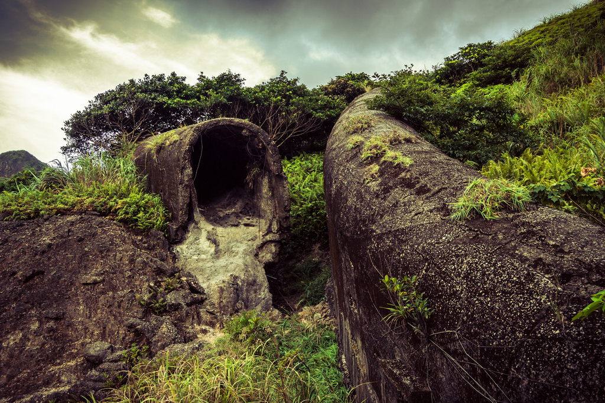

## Equipment

I mainly shoot with a Nikon D3100 (formerly a D40) and the kit lens (18--55mm). I have explored using accessories such as a tripod and a bounce flash but always return to a minimal setup for ease of use and portability.

## Processing

I make extensive use of Adobe Lightroom in my post-processing workflow. All of my development presets are open source and available for download via [GitHub](https://github.com/synapticism/synaptic-lightroom-presets). The collection is constantly evolving as I learn more about the software and experiment with new techniques.

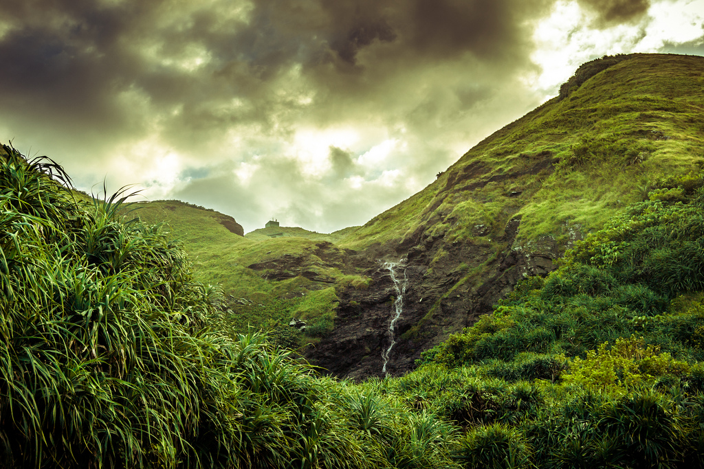

## Terms of use

I release almost all of my photos under a [Creative Commons (BY-NC) licence](https://creativecommons.org/licenses/by-nc/3.0/). You do not need to secure my permission to use most of my photos but you must understand and respect the terms of the Creative Commons licence those photos have been released under. I require attribution in the form of "Photo by Alexander Synaptic ([synapticism.com](http://synapticism.com))".

I place one additional limitation on the usage of my photography: you must secure for permission to use or alter any photo where the primary subject is a person or group of people. Please contact me for commercial usage.

## On the web

All my properly geotagged photographs are available in full quality via [Flickr photostream](https://secure.flickr.com/photos/synapticism/).

I also publish [themed galleries of my work](http://synapticism.com/c/portfolio/photography/) on [my personal blog](http://synapticism.com).

[Many of my photos are available on Facebook](https://www.facebook.com/synaptic/photos_albums). If it is shared publicly you are welcome to "like" or comment on my photos---but please note that I do not accept friend requests without an introduction.

Follow me on [Instagram](http://www.instagram.com/synapticx) for a more immediate and far less serious glimpse into my life. I use it just for fun; don't expect me to be making art over there.

## Recent work

Here are a few examples of my recent work in Asia:

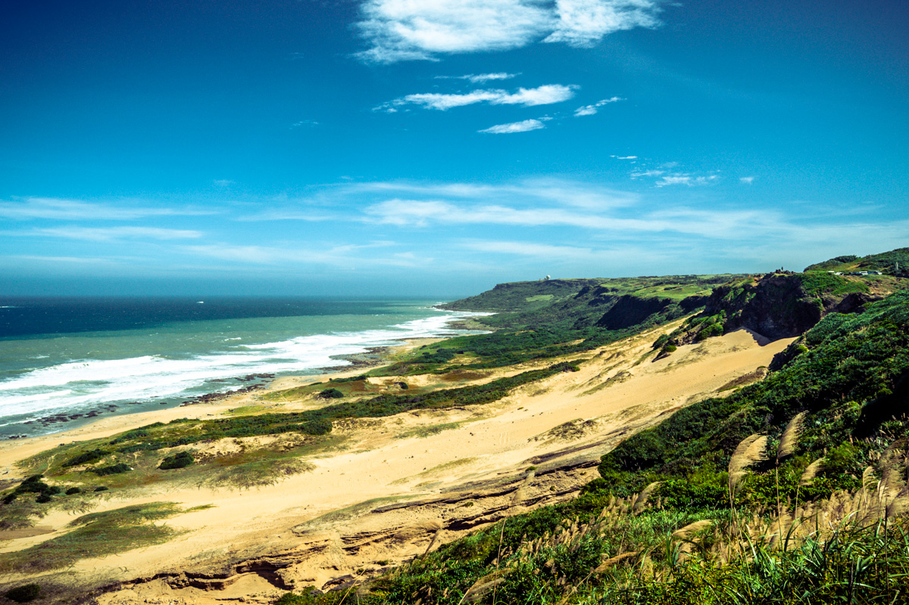

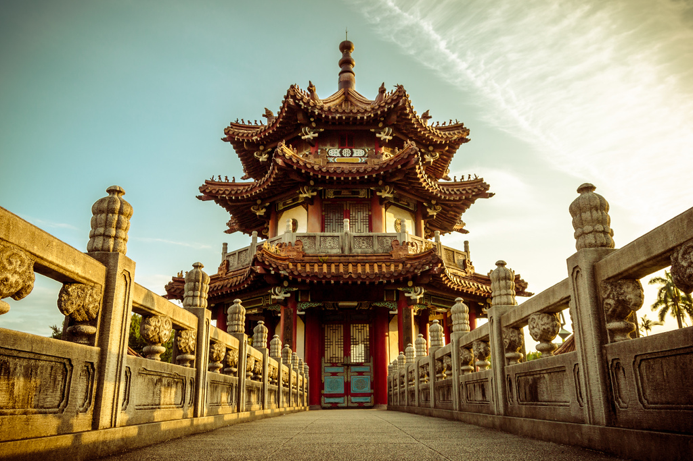

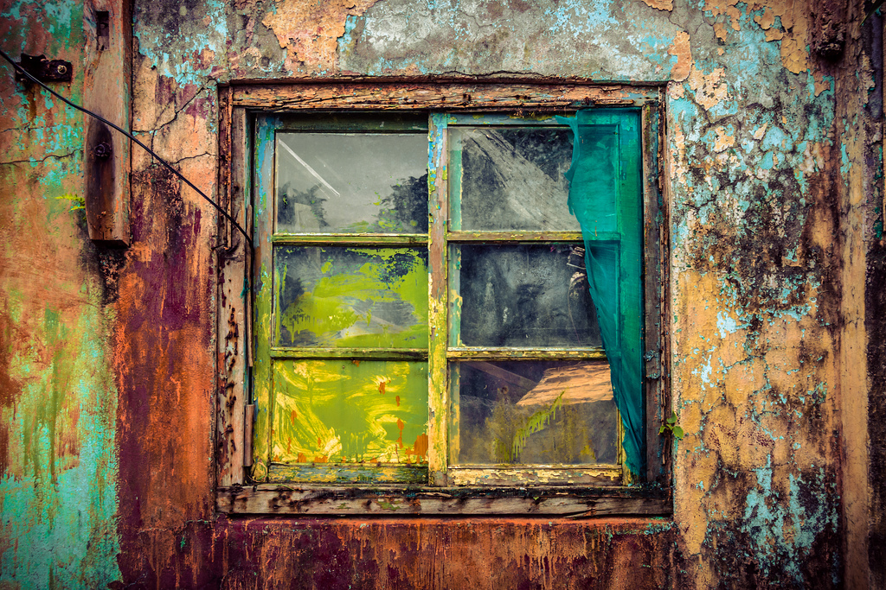

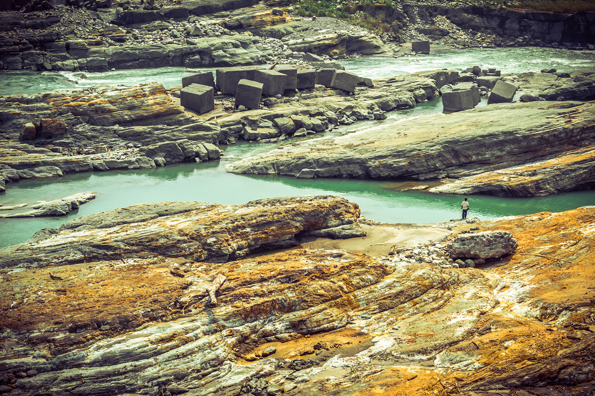

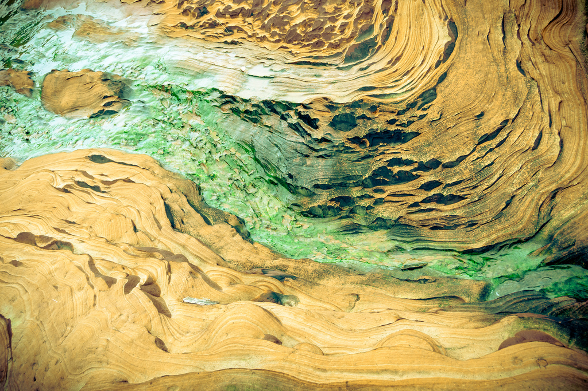

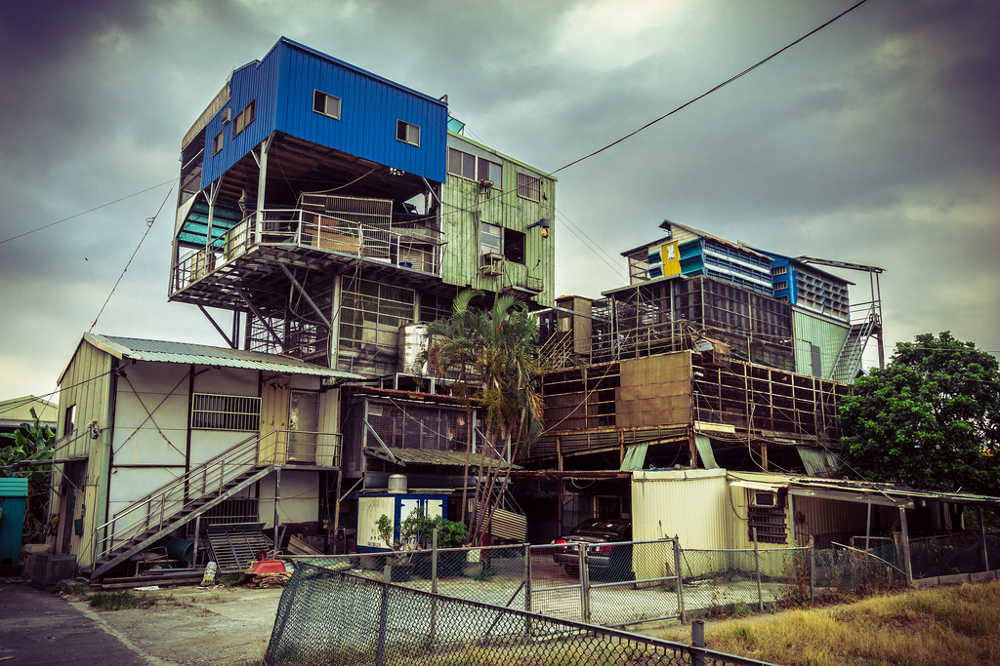

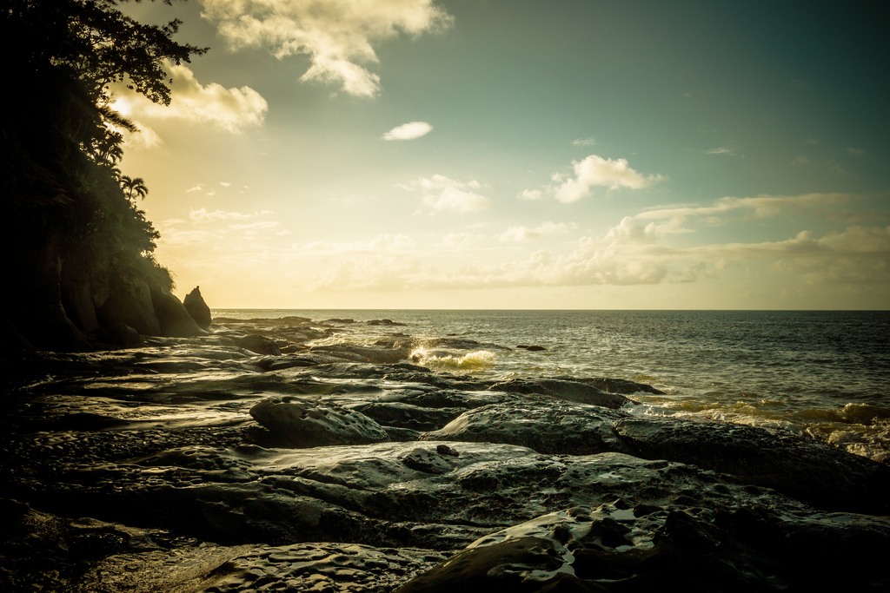

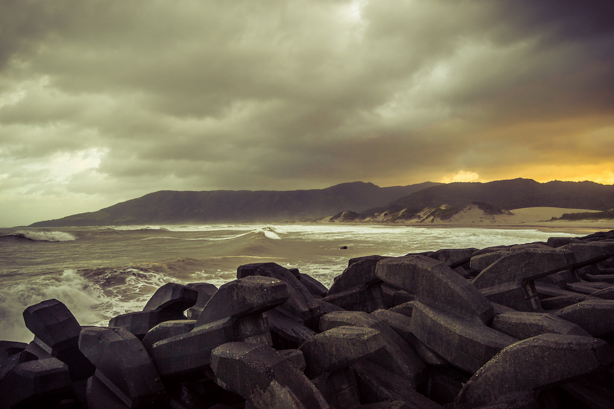

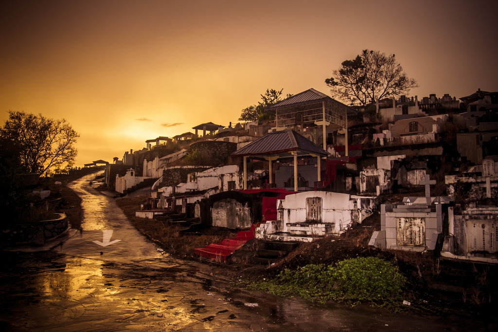

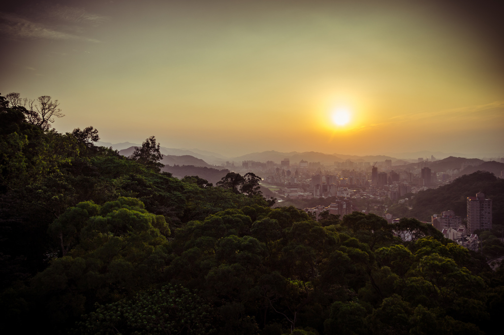
